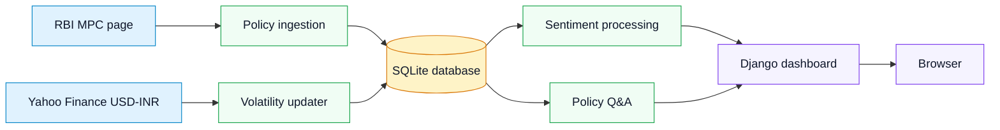

# 📊 Macro-Sentiment Dashboard

A Django dashboard that keeps the latest RBI Monetary Policy Committee document in sync, analyzes policy sentiment, and compares it with USD-INR exchange-rate volatility.

## What It Does

- Fetches the latest RBI MPC resolution or minutes from RBI's Monetary Policy page.
- Stores policy documents, source URLs, publish dates, and sentiment results.
- Preserves historical MPC observations for five-year charts.
- Pulls USD-INR data from Yahoo Finance and stores 20-day annualized volatility.
- Answers questions about the latest RBI policy using Gemini when configured, or a deterministic local parser when not.

## How It Works



## Project Structure

```text
Macro-Sentiment/
├── manage.py
├── macro_sentiment_project/
│   ├── settings.py
│   ├── urls.py
│   ├── asgi.py
│   └── wsgi.py
├── macro_sentiment/
│   ├── models.py
│   ├── views.py
│   ├── ingestion.py
│   ├── market_data.py
│   ├── logic.py
│   ├── tasks.py
│   ├── tests.py
│   └── management/commands/
├── templates/dashboard.html
├── Dockerfile
├── build.sh
├── render.yaml
└── requirements.txt
```

## Setup

```bash
python3 -m pip install -r requirements.txt
python3 manage.py migrate
python3 manage.py seed_five_year_mpc_data
python3 manage.py ingest_latest_rbi_policy
python3 manage.py update_usdinr_volatility --years 5 --window 20
python3 manage.py runserver
```

Open `http://127.0.0.1:8000/`.

## Docker

Build the image:

```bash
docker build -t macro-sentiment .
```

Run the container:

```bash
docker run --rm -p 8000:8000 \
  -e DJANGO_SECRET_KEY="replace-with-a-long-random-secret" \
  -e DJANGO_ALLOWED_HOSTS="localhost,127.0.0.1" \
  macro-sentiment
```

Open `http://127.0.0.1:8000/`.

The container runs migrations, seeds historical MPC data, attempts the latest RBI policy ingestion, attempts USD-INR volatility refresh, then starts gunicorn.

## Fresh Data Behavior

By default, the dashboard attempts a live RBI refresh on every request before rendering. If RBI or the network is unavailable, the page still renders the latest document already stored in the database and shows a refresh warning.

Useful commands:

```bash
python3 manage.py ingest_latest_rbi_policy
python3 manage.py ingest_latest_rbi_policy --url "https://www.rbi.org.in/Scripts/BS_PressReleaseDisplay.aspx?prid=..."
python3 manage.py update_usdinr_volatility --years 5 --window 20
python3 manage.py seed_five_year_mpc_data
```

## Environment Variables

```text
DJANGO_DEBUG=True
DJANGO_SECRET_KEY=<secret>
DJANGO_ALLOWED_HOSTS=127.0.0.1,localhost
GOOGLE_API_KEY=<optional Gemini API key>
GOOGLE_GENAI_CHAT_MODEL=gemini-2.5-flash
RBI_POLICY_URL=<optional explicit RBI policy URL>
RBI_REFRESH_ON_REQUEST=True
```

`GOOGLE_API_KEY` is optional. Without it, sentiment and Q&A fall back to local rule-based parsing.

## Verification

```bash
python3 manage.py check
python3 manage.py test macro_sentiment
```
