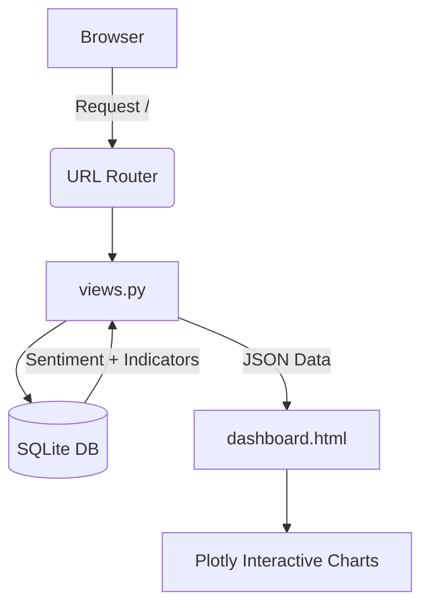

# 📊 Macro-Sentiment Dashboard

This Django-powered web application analyzes macroeconomic policy documents using AI and visualizes the resulting sentiment against key economic indicators.

---

## 🌟 The Big Picture
The app transforms raw policy text into actionable visual insights through a streamlined pipeline:

1.  **Policy Document** is uploaded/ingested.
2.  **Database Storage** secures the text content.
3.  **AI Analysis** (Gemini) extracts sentiment scores.
4.  **SentimentResult** is saved to the DB.
5.  **Dashboard View** aggregates analysis and indicators.
6.  **Interactive Visualization** via [Plotly](https://plotly.com/) in `dashboard.html`.

---

## 🏗️ Project Structure
```text
Macro-Sentiment/
├── manage.py                    # CLI Entry point
├── db.sqlite3                   # Local Data Storage
├── macro_sentiment_project/     # Core Project Settings
│   ├── settings.py, urls.py, asgi/wsgi
└── macro_sentiment/             # App Logic
    ├── models.py, views.py      # Data & Display
    ├── tasks.py, logic.py       # AI & RAG Workers
    └── templates/               # UI Layer
```

---

## 🛠️ Core Components

### 🖥️ Management & Config
| File | Role | Key Functionality |
| :--- | :--- | :--- |
| `manage.py` | **The Controller** | Runs server, migrations, and shell commands. |
| `settings.py` | **The Brain** | Manages `INSTALLED_APPS` and template directories. |
| `urls.py` | **The Map** | Routes `http://127.0.0.1:8001/` to the dashboard view. |

### 📊 Data Models (`models.py`)
> **PolicyDocument**: Stores titles, content, and sources (e.g., RBI statements).
> **SentimentResult**: Stores AI outputs (Scores, Labels like "Hawkish/Dovish").
> **EconomicIndicator**: Stores raw data (e.g., Exchange Rate Volatility).

### ⚙️ Backend Logic
* **`views.py`**: The bridge. It queries the database and converts data into **JSON** for the frontend.
* **`tasks.py`**: The background worker. Uses **Celery** to send documents to Gemini for sentiment analysis without freezing the UI.
* **`logic.py`**: The future-proof **RAG (Retrieval-Augmented Generation)** engine for natural language Q&A.

---

## 📈 Visualizing the Flow

### System Architecture


### AI Processing Pipeline
1.  **Trigger**: New `PolicyDocument` is saved.
2.  **Action**: `tasks.py` triggers a Celery task.
3.  **Process**: Gemini API analyzes the sentiment.
4.  **Result**: `SentimentResult` is written back to the DB for the dashboard to pick up.

---

## 🚀 Current Status & Next Steps

### **Current Working Version**
* **Engine**: Django + SQLite.
* **Visualization**: Interactive Line (Sentiment) and Bar (Volatility) charts.
* **Data**: Currently uses sample rows for immediate preview.

### **Next Stage Requirements**
To move from a dashboard foundation to a fully automated AI pipeline, you will need:
* [ ] **Google Gemini API Key** for live analysis.
* [ ] **Celery/Redis** setup for background tasking.
* [ ] **PostgreSQL + pgvector** for advanced vector similarity search.
* [ ] **Ingestion Pipeline** for bulk document uploads.
